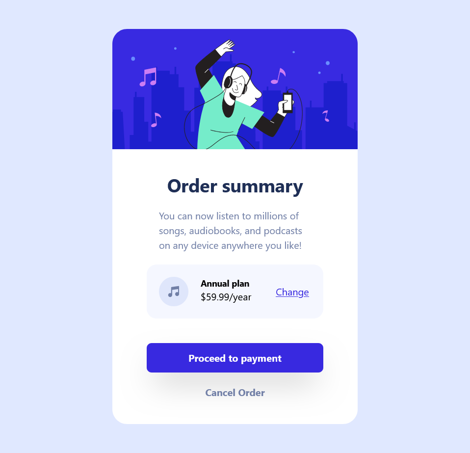

# Frontend Mentor - Order summary card solution

This is a solution to the [Order summary card challenge on Frontend Mentor](https://www.frontendmentor.io/challenges/order-summary-component-QlPmajDUj).

## Table of contents

- [Overview](#overview)
  - [Screenshots](#screenshots)
- [My process](#my-process)
  - [Built with](#built-with)

## Overview

### Screenshots

## My process

### Built with

- Semantic HTML5 markup
- Flexbox
- Mobile-first workflow
- React
